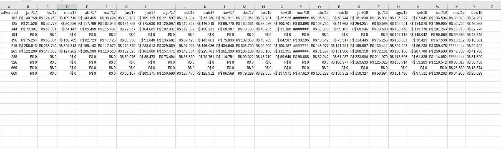
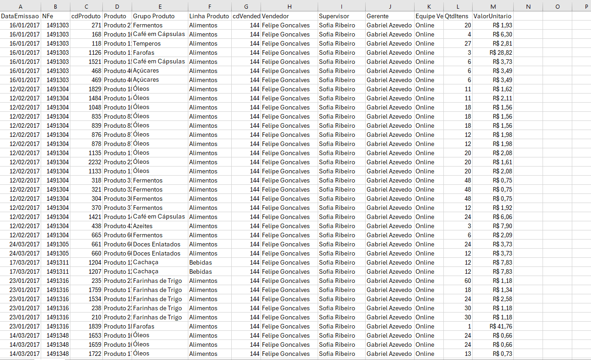
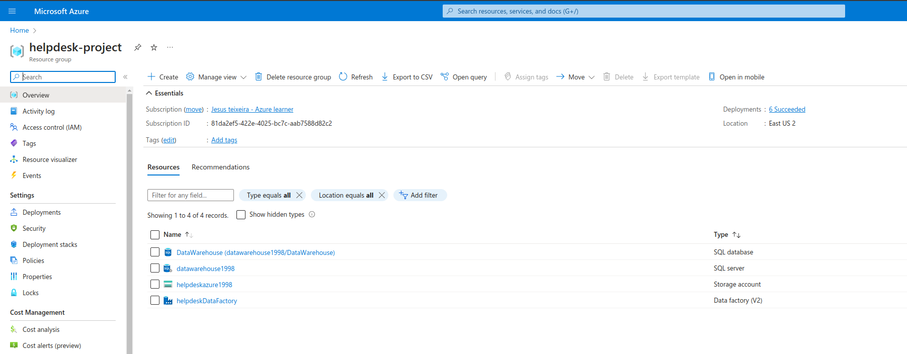
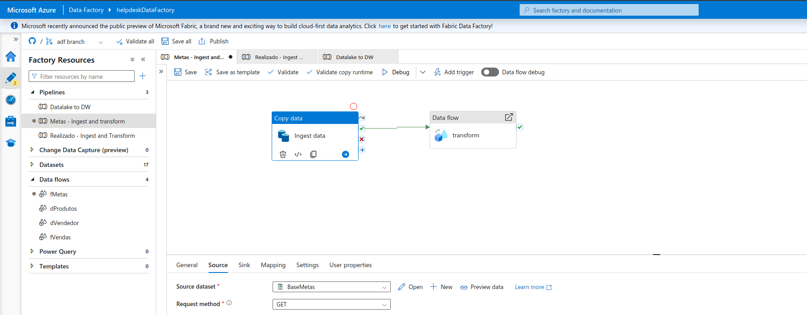
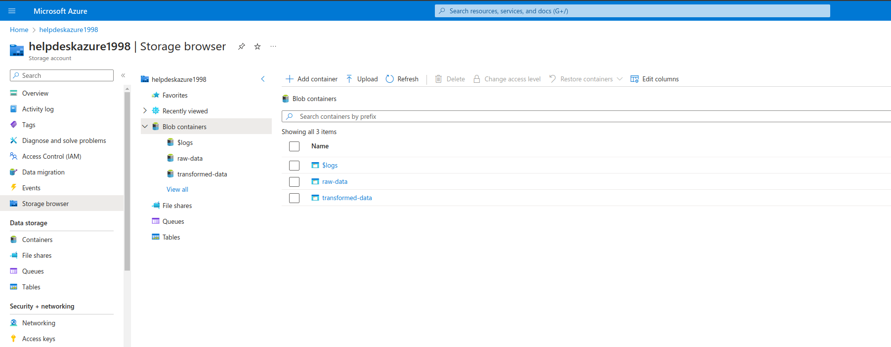
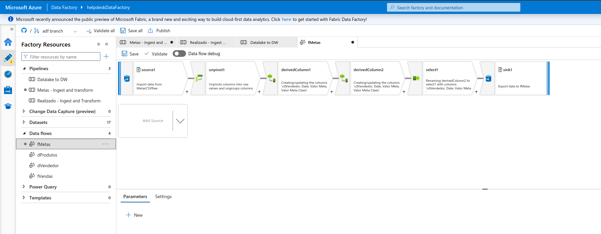

# Análise de Vendas
<b>Obs:</b> Os dados utilizados nesse projeto estão disponíveis no repositório do github no formato csv.   

# Data pipeline com Azure e Power BI
Neste projeto utilizei ferramentas do Microsoft Azure para implementar uma arquitetura de dados, desde a extração até a camada de serving, por fim utilizei o Power BI para desenvolver um dashboard com os dados trabalhados ao longo do projeto.
  

### 1.1. Sobre o Projeto
O projeto tem como objetivo executar a coleta, limpeza, preparação e modelagem dos dados utilizando ferramentas do Microsoft Azure como Azure DataLake Gen2, Data Factory e Azure SQL. 
Bases Utilidazadas no projeto e o Grupo de Recurso do azure estão abaixo:

Table Metas:

    

Table Vendas:

    

Grupo de Recursos:

    

Obs: A tabela de Vendas está estruturada como uma bigtable, a ideia é aplicar processos de normalização dentro desta tabela para otimizar o storage e criar uma modelagem estrela.
  

### 1.2. Problema de Negócio
A equipe de TI implementou com sucesso uma rotina automatizada para extrair diariamente dados de um banco de dados relacional e disponibilizá-los como arquivos CSV em um endereço da WEB. Minha responsabilidade como Engenheiro de Dados é criar o pipeline de dados e realizar a ingestão desses dados Datawarehouse que está em um Azure SQL.

## 2. Arquitetura do Pipeline
  

    

 

### 2.1. Ingestão de Dados - Azure Data Factory
A ferramenta escolhida para fazer a ingestão de dados do end-point web para o Datalake foi o DF, por ser uma ferramenta relativamente barata e escalonável, além de ser No Code.

    

O processo de implantação e configuração do Data Factory é notavelmente simples. Basta selecionar uma atividade de cópia de dados, na sequencia selecioe a fonte de dados e um destino, e em seguida, basta executar o pipeline com a função debug. Para que aconteça de forma recorrente basta agendar a tarefa no próprio recurso do Azure Data Factory incluindo a definição da periodicidade para a carga de dados. 

  

### 2.2. Datalake - Azure DataLake Gen 2
Dentro do datalake foi criado 2 camadas: raw, transformed. 
Na camada raw estão armazenados os dados brutos, está é a camada onde ocorre a ingestão de dados do Data Factory. Os dados estarão na camada tranformed após passar pelas etapas de limpeza, tratamento e inclusão de regras de negócio, os dados serão carregados nesta camada pelo Data Factory. 
  

    

### 2.3. Processamento de dados - Azure Data Factory
O processamento dos dados foi feito dentro do Azure Data Factory, utilizei a ferramenta dataflow (que é muito similar ao SSIS) para aplicar transformações nos dados, como por exemplo, pivotagem de tabela, criação de colunas, mudar tipos e aplicar filtros. 

Dataflow:

    

Para acessar o código gerado pelo Data Factory use esse link: https://github.com/Jesus-Teixeira-DS98/commercial_analysis/tree/adf
  

### 2.4. Data Serving - Azure SQL 
Ao disponibilizar os dados na camada transformed do Datalake são transferidos para o Azure SQL por meio do ADF. Ao disponibilizar os dados dento do DW solicitado o pipeline de dados está completo e pode ser consumido por ferramentas de Dataviz como Power BI.
  

Dados dentro das tabelas no Azure SQL:

    

## 3. Lições Aprendidas
- Uso de Excalidraw para desenhar e planejar meus projetos;
- Provisionamento de Storages (Datalake) na Azure;
- Provisionamento de Azure Data FActory;
- Provisionamento de Azure SQL;
- Configuração de Virtual Network;
- Como utilizar Dataflow e Data Copy do ADF.
  

## 4. Próximos Passos
- Usar Azure Data Vault para aumentar segurança do projeto;
- Processar dados no Databricks;
- Implementar regra de carga incremental durante processos de ingestão e carga de dados.
 <b